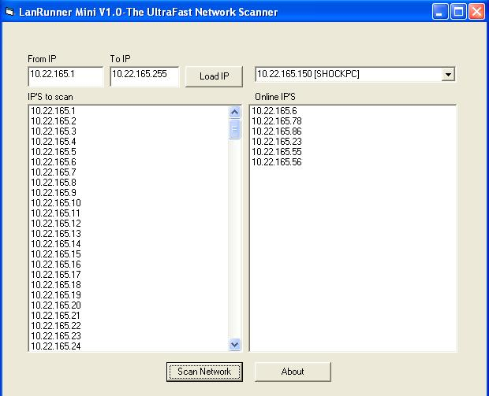



## LanRunner Mini V 1\.0

### Description

This is an Ultra fast network scanner.May be the first one in PSC.It scans the entire range of IP's(255 +) in less than 0.1 sec and notifies you, who the online IP'S.Please vote if you like!
 
### More Info
 

             |
---                |---
**Submitted On**   |2007-06-07 10:20:16
**By**             |[V\.Ravindran](https://github.com/Planet-Source-Code/PSCIndex/blob/master/ByAuthor/v-ravindran.md)
**Level**          |Intermediate
**User Rating**    |5.0 (15 globes from 3 users)
**Compatibility**  |VB 5\.0, VB 6\.0
**Category**       |[Internet/ HTML](https://github.com/Planet-Source-Code/PSCIndex/blob/master/ByCategory/internet-html__1-34.md)
**World**          |[Visual Basic](https://github.com/Planet-Source-Code/PSCIndex/blob/master/ByWorld/visual-basic.md)
**Archive File**   |[LanRunner\_2072176232007\.zip](https://github.com/Planet-Source-Code/v-ravindran-lanrunner-mini-v-1-0__1-68873/archive/master.zip)

